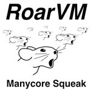

RoarVM - The Manycore SqueakVM
==============================

RoarVM, formerly known as the Renaissance Virtual Machine (RVM) is developed
as part of a IBM Research project to investigate programming paradigms and
languages for manycore systems of the future. Specifically, this VM is meant
to support manycore systems with more than 1000 cores in the future.

The RVM was open sourced by IBM Research under the `Eclipse Public License`_.
Please see the `open source announcement`_ for further information

Today, the RoarVM supports the parallel execution of Smalltalk programs on x86
compatible multicore systems and Tilera TILE64-based manycore systems. It is
tested with standard Squeak 4.1 closure-enabled images, and with a stripped
down version of a MVC-based Squeak 3.9 image.

The RoarVM provides parallel execution of Smalltalk processes and thus, the
programming model is a typical shared-memory model similar to Java with its
threads and classical Pthreads for C/C++.

.. _Eclipse Public License:   http://www.eclipse.org/legal/epl-v10.html
.. _open source announcement: http://soft.vub.ac.be/~smarr/rvm-open-source-release/

Install and Use
---------------

Please see the INSTALL.rst file.

Features
--------

The RoarVM is compatible with Squeak and its forks. However, the Smalltalk
images needs a number of changes to enable it to utilize more than one core
and to interact with the VM correctly.

 - compatible with Squeak 4.1 and Pharo 1.2
 
   - the RoarVM has full closure support
   
 - Smalltalk processes are executed in parallel
 
 - tested with 8 cores, 16 hyperthreads on Intel systems

 - tested with 56 cores on Tilera TILE64/TILEPro64 processors
 
 - tested with Linux and Mac OS X 10.6

Purpose
-------

The source code of the RoarVM has been released as open source to enable the
Smalltalk community to evaluate the ideas and possibly integrate them into
their existing systems. The RoarVM provides the necessary functionality to
experiment with Smalltalk systems on multi- and manycore machines, which we
would like to encourage.

However, we also welcome all contributions to the RoarVM itself. Either to
bring it up to the speed of the existing VMs or to extend it for further
experiments.

Known Issues
------------

The RoarVM is a research project and is not as optimized for performance as
the standard Squeak VM. Thus, its sequential performance is slower. This is
due to the fact that the RoarVM misses optimizations like using the GCC label
as value extension to speed up the interpreter.

 - single core performance is slower than the Squeak VM
 
   * Squeak 4.2.4beta1U, MVC image, OS X
     554844390 bytecodes/sec; 12213718 sends/sec

   * RoarVM, MVC image, OS X, 1 core
     66286897 bytecodes/sec;  2910474 sends/sec
   
   * RoarVM, MVC image, OS X, 8 cores
     470588235 bytecodes/sec; 19825677 sends/sec
   
 - idle process does not yield when the RoarVM is run on more than one core

   - the event processing is not adapted fully yet, thus, the idle process
     is busy-waiting for performance reasons

   - will drain your battery, on mobile devices

 - Garbage collector is as simple as possible

   - it is neither concurrent nor parallel

   - performance can be problematic

 - Graphical subsystem based on X11

   - in contrast to todays Squeak VM, especially the OS X version,
     the RoarVM uses solely X11 and does not integrate as well into the OS
     as Squeak does

 - Stability should be ok, however, crashes can happen occasionally 

Technical Overview
------------------

The implementation details of the RoarVM are currently documented in:

  [1] Hosting an Object Heap on Manycore Hardware: An Exploration,
      by David Ungar, and Sam S. Adams, in Proceedings of the 5th Symposium on
      Dynamic Languages, ACM (2009), p. 99-110.
      http://portal.acm.org/citation.cfm?id=1640134.1640149
  
  As well as an VEE submission which is currently under review.
  
Furthermore, the design is based on the following earlier work:
  
  [2] Multiprocessor Smalltalk: A Case Study of a Multiprocessor-Based 
      Programming Environment
      by Joseph Pallas, and David Ungar, in Proceedings of the ACM SIGPLAN
      1988 Conference on Programming Language Design and Implementation,
      ACM (1988), p. 268-277.
      http://portal.acm.org/citation.cfm?id=54017

The RoarVM resembles the Squeak VM which is written in Smalltalk/Slang,
however, it is rewritten in C++ to facilitate the development on manycore
architectures. The C source code of for instance plugins to the Squeak VM has
been reused directly. This code is located in /src/from squeak/.

The support for x86 compatible multicore systems is currently based on POSIX
threads. Thus, the RoarVM can be started with a number of threads which are
executed on distinct processor cores. On Tilera TILE64-based systems, the iLib
library is used and for each processor core a separate processes is started
which executes an interpreter instance each. For both architectures, the VM
provides the illusion of a single object heap, spanning all of the cores, to
the Smalltalk user. Smalltalk processes are scheduled by a single scheduler on
the available processor cores, and thus, the processes can execute in
parallel. For synchronization, the standard Smalltalk mechanisms are
available. Semaphores as well as mutexes work as in classical systems.
Currently, the RoarVM uses a single central scheduler which is based on the
design of Pallas[2]. Its data structures are accessible from the image and
only require minimal modifications to the image, since the do not change the
general model of execution.

A distinct feature of the RoarVM is its use of an object table. It was
introduced to reduce the necessary complexity to enable object migration
between heaps on manycore architectures.

TODO: add some remarks on the heap structure

License
-------

Copyright (c) 2008 - 2010 IBM Corporation and others.
All rights reserved. This RoarVM and the accompanying materials are made
available under the terms of the Eclipse Public License v1.0 which accompanies
this distribution, and is available at:

  http://www.eclipse.org/legal/epl-v10.html

All parts directly taken over from the original Squeak source code are
licensed under their original licenses.

Credits
-------

Since the RoarVM is based on the work which has been done for Squeak, we would
like to acknowledge the Squeak community as a whole for its valuable work.

The RoarVM was designed and implemented as 'Renaissance VM' by
  David Ungar and Sam Adams at IBM Research.

It was ported to x86 compatible multicore systems by
  Stefan Marr at the Software Languages Lab, Vrije Universiteit Brussel.

Special thanks go to Max OrHai for designing our Logo.

